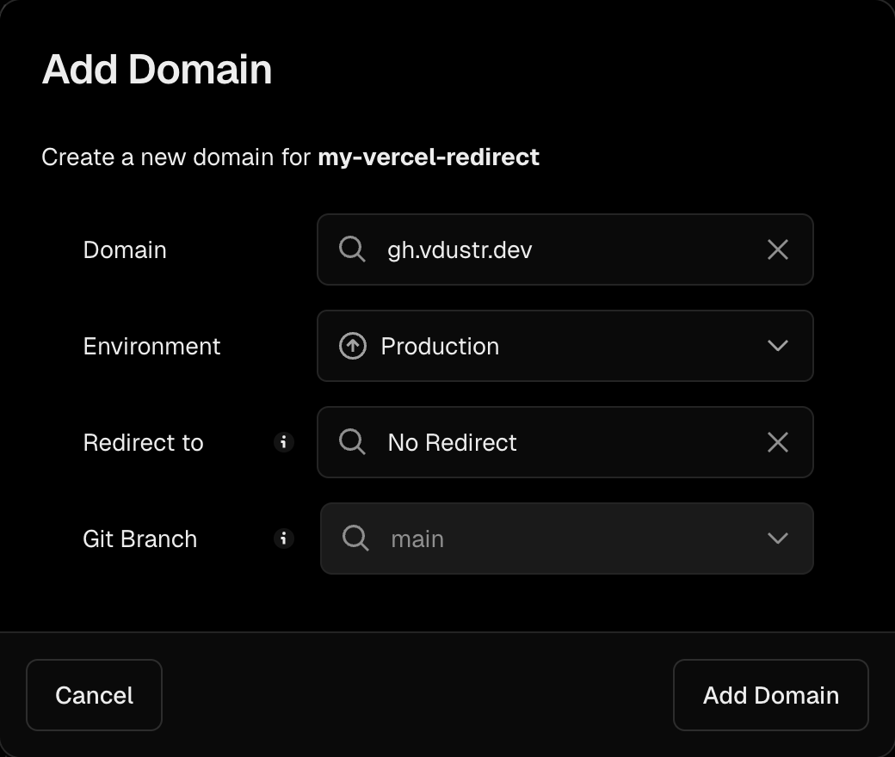

# My Vercel App for Subdomain Redirects

This is a Vercel application that enables subdomain redirection to other domains using Edge Middleware.

## Usage

1. Fork this repository and update the `myDomain` and `subdomainMap` variables in `middleware.ts`.
2. Deploy your forked repository to Vercel and configure the domains listed in the `subdomainMap` variable.
3. Set up the domain in your Vercel project:  
   

## Local Testing

- Run `pnpm i` to install dependencies.
- Run `pnpm vercel:dev` to start the local development server.
- Open your browser and visit `http://gh.dev.localhost:3000`.
- Run `pnpm build -w` in another terminal to watch for changes.

## Reference

- [Redirects](https://vercel.com/docs/concepts/edge-network/redirects)
- [Edge Middleware](https://vercel.com/docs/concepts/functions/edge-middleware)

## License

The code is licensed under the [MIT License](./LICENSE), and the documentation is licensed under the [CC BY-NC-SA 4.0](https://creativecommons.org/licenses/by-nc-sa/4.0/) license.
