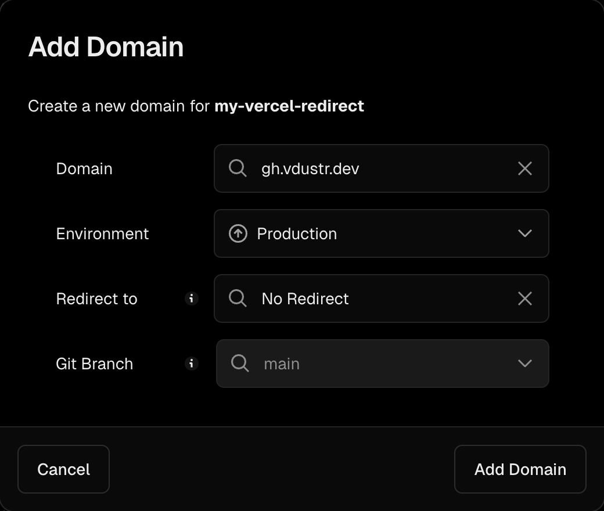

# My Vercel App for Subdomain Redirects

This Vercel application redirects the apex domain to GitHub Pages and keeps the
`blog` subdomain as a convenience URL using Routing Middleware.

| Source            | Destination        |
| ----------------- | ------------------ |
| `vdustr.dev`      | `vdustr.github.io` |
| `blog.vdustr.dev` | `vdustr.dev/blog`  |

## Usage

1. Fork this repository and update the `domain` and `redirects` variables in `middleware.ts`.
2. Deploy your forked repository to Vercel and configure the domains listed in `redirects`.
3. Set up the domain in your Vercel project:  
   

## Local Testing

- Install [mise](https://mise.jdx.dev/), then run `mise install`.
- Run `mise run install` to install dependencies.
- Run `mise run dev` to start the local development server.
- Open your browser and visit `http://dev.localhost:3000` or
  `http://blog.dev.localhost:3000`.
- Run `mise run check` to check formatting and types.

## Reference

- [Redirects](https://vercel.com/docs/concepts/edge-network/redirects)
- [Edge Middleware](https://vercel.com/docs/concepts/functions/edge-middleware)

## License

The code is licensed under the [MIT License](./LICENSE), and the documentation is licensed under the [CC BY-NC-SA 4.0](https://creativecommons.org/licenses/by-nc-sa/4.0/) license.
